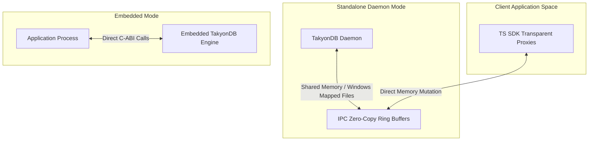

# TakyonDB — "Your Data Instantly"

TakyonDB is an ultra-low-latency, dual-mode (embedded and standalone daemon) storage engine designed for zero-latency operations. Written in Zig for absolute control over memory allocations and leveraging Zero-Copy IPC with shared memory (POSIX `shm` / Windows Mapped Files) via a stable C-ABI, TakyonDB allows high-performance SDKs (starting with TypeScript) to access and mutate data directly in memory without traditional serialization or socket overhead.

## Vision & Architecture

Traditional databases introduce overhead through network protocols, context switches, serialization (e.g., JSON, Protocol Buffers), and parser overhead. TakyonDB bypasses these layers by storing data in structured, layout-compatible memory mappings.



### 1. Bi-Modal Operation
*   **Embedded Mode:** Linked directly via C-ABI into the host application process, running in-process for direct access with no boundary crossing.
*   **Daemon Mode:** Operates as a standalone system process. Clients communicate via shared memory segments mapping the database files directly to user-space memory, using lock-free ring buffers for coordination.

### 2. Zero-Copy IPC
Clients map the memory of the database files directly into their virtual address spaces. Mutating a JavaScript/TypeScript object operates through transparent JS `Proxy` objects, writing directly into the mapped layout. Zero serialization, zero network packets, zero context switches.

---

## Repository Structure

```
├── docs/
│   ├── architecture/       # Deep-dive design documents
│   └── STYLEGUIDE.md       # Coding standards and formatting guidelines
├── src/
│   ├── core/               # Zig storage engine source files
│   └── sdk/
│       └── ts/             # TypeScript SDK wrapper
├── scripts/                # Development, benchmarking, and build helper scripts
├── build.zig               # Zig build configuration
├── CONTRIBUTING.md         # Contribution guidelines
├── LICENSE                 # GNU AGPLv3 License
├── COMMERCIAL_LICENSE.md   # Commercial license terms for proprietary forks
└── .gitignore              # Project-wide ignore rules
```

---

## License

TakyonDB is dual-licensed under:
1.  **GNU Affero General Public License v3 (AGPLv3)**: Free for open-source development, testing, and self-hosted non-commercial scenarios. Any modifications or applications exposing TakyonDB over a network must share their source code under the same terms.
2.  **Commercial License**: For enterprise clients who require closed-source modifications, proprietary integrations, or exemption from AGPLv3 copyleft terms.

See [LICENSE](file:///C:/Users/Alumnos/Downloads/TakyonDB/LICENSE) and [COMMERCIAL_LICENSE.md](file:///C:/Users/Alumnos/Downloads/TakyonDB/COMMERCIAL_LICENSE.md) for full details.
